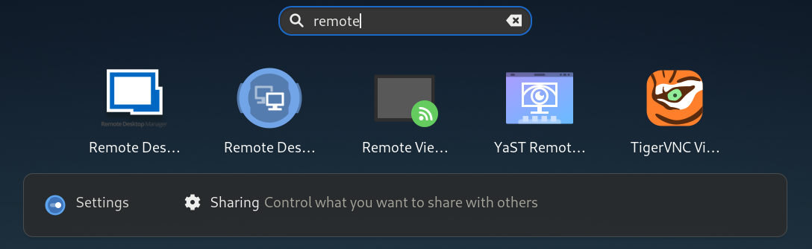
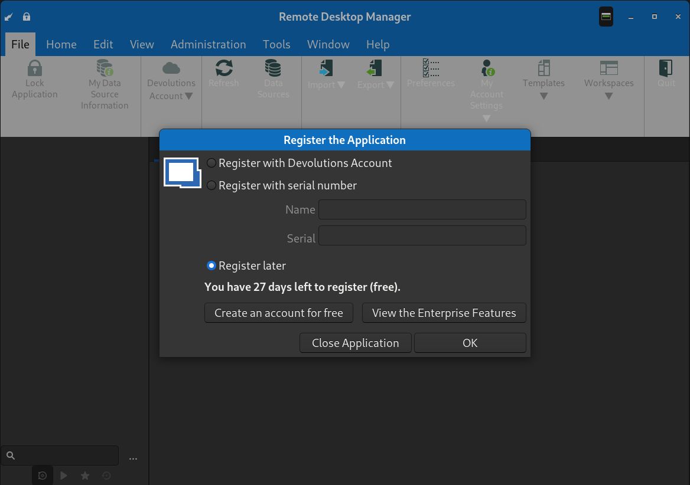

# remotedesktopmanager-installer

**Use at your own risk**

Installer for OpenSUSE.




## Installation

### Step 1: Download the repo

To get things going, use:
``` bash
git clone https://github.com/robwilkes/remotedesktopmanager-installer
cd remotedesktopmanager-installer
```
### Step 2: Download latest .deb file (to same dir)

``` bash
wget https://cdn.devolutions.net/download/Linux/RDM/2020.3.2.2/RemoteDesktopManager.Free_2020.3.2.2_amd64.deb
```

### Step 3: Run the installer

``` bash
./install.sh RemoteDesktopManager.Free_2020.3.2.2_amd64.deb
```
You will see output similar to:
```
Extracting .deb archive to RemoteDesktopManager.Free_2020.3.2.2_amd64
Moving installation dir to /home/username/.local/bin/
Moving application icon to /home/username/.local/share/icons/
Creating substitute cmdline launcher /home/username/.local/bin/remotedesktopmanager.free
Creating .desktop shortcut /home/username/.local/share/applications/remotedesktopmanager.free.desktop
Removing temporary dir - RemoteDesktopManager.Free_2020.3.2.2_amd64
```

